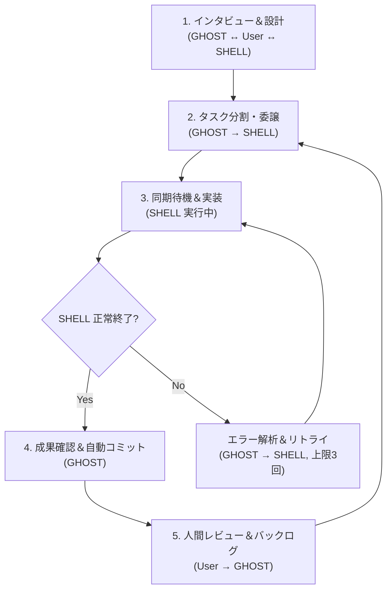

# AWS SAA Cards

`study-memo/AWSSAA_Dictionary_2026.md` を元にした、スマホ向けの単語帳Webアプリです。React + Vite 構成で、カード反転、`後で確認` / `知らない` フラグ、カテゴリ・タグ・フラグによる複合絞り込み、PWA対応を入れています。

フロントエンド構成の詳細は `docs/aws-saa-cards-frontend-structure.md` を参照してください。

## App Commands

```bash
npm install
npm run dev
```

- 辞書データは `npm run dev` / `npm run build` の前に `scripts/build-dictionary.mjs` で自動生成されます。
- 生成JSONは `src/data/generated/dictionary.json` に出力されます。

## Deploy

- GitHub Pages 用のワークフローは `.github/workflows/deploy-pages.yml` に追加済みです。
- GitHub 側で Pages の Build and deployment を `GitHub Actions` に設定すれば、`main` ブランチへの push でデプロイできます。
- Pages 配下では `vite.config.ts` が `/awssaa_in_the_ghost/` を自動ベースパスとして使います。

---

# GHOST in the SHELL — AI連携ワークフロー テンプレート

> GHOST（Antigravity / Gemini）と SHELL（Claude Code）の連携ルール・ディレクトリ構成を
> 任意のプロジェクトにすぐ導入するためのテンプレートです。

---

## Prerequisites（前提条件）

このテンプレートを使用するには、以下のツールがインストール・設定済みである必要があります。

| ツール | 説明 |
|---|---|
| **Antigravity（Gemini）** | エディタ統合型 AI アシスタント（GHOST 役） |
| **Claude Code CLI (`claude`)** | ターミナルから起動する AI アシスタント（SHELL 役） |
| **Git** | バージョン管理。自動コミット機能を利用するため必須 |

---

## セットアップ

1. **テンプレートをプロジェクトルートにコピー**

   ```bash
   cp -r gohst_in_the_shell/* <YOUR_PROJECT_ROOT>/
   cp -r gohst_in_the_shell/.ai-tasks <YOUR_PROJECT_ROOT>/
   cp gohst_in_the_shell/.gitignore <YOUR_PROJECT_ROOT>/
   ```

   > **Note**: `cp -r` はドットファイル（`.ai-tasks/`, `.gitignore`）を展開しないため、個別にコピーしてください。

2. **プロジェクトに合わせてカスタマイズ**

   - `.ai-tasks/project.md`: プロジェクトの目標・マイルストーン・共有ルールを記入
   - `GEMINI.md` / `CLAUDE.md`: プロジェクト固有のルールを追記

3. **ワークフロー開始**

   GHOST（Antigravity）にタスクの相談を開始すると、計画 → 監査 → 委譲 → コミットのサイクルが回り始めます。

---

## ファイル構成と役割

```text
<YOUR_PROJECT_ROOT>/
├── GEMINI.md                              ... GHOST 行動規範（project.md 読み込みチェーン含む）
├── CLAUDE.md                              ... SHELL 行動規範（project.md 読み込みチェーン含む）
├── .gitignore                             ... 推奨 .gitignore サンプル
└── .ai-tasks/
    ├── project.md                         ... 共有コンテキスト + 共有ルール
    ├── backlog/                           ... 残タスク蓄積（軽微なバグ・UI修正等）
    │   └── .gitkeep
    ├── knowledge/                         ... ユーザーコンテキストの明示的蓄積（GHOST が管理）
    │   └── task_delegation_guidelines.md  ... タスク委譲ガイドライン（サンプル）
    ├── templates/
    │   └── task_template.md               ... タスク指示書テンプレート
    └── tasks/                             ... アクティブなタスク指示書
        └── history/                       ... 完了タスクの履歴
```

### 各ファイルの役割

| ファイル | 対象 | 内容 |
|---|---|---|
| `GEMINI.md` | GHOST のみ | GHOST の行動規範（計画監査、タスク委譲、ナレッジ蓄積、ルール可視化など） |
| `CLAUDE.md` | SHELL のみ | SHELL の行動規範（タスク実行、タスクサイズ自己判断、技術監査、自律的エラー解決） |
| `project.md` | GHOST・SHELL 両方 | プロジェクト目標、アーキテクチャ概要、共有ルール、重要な決定事項 |
| `knowledge/` | GHOST が管理 | ユーザーの好み・方針・制約など、AIが蓄積した明示的コンテキスト |
| `backlog/` | GHOST が管理 | ユーザーのレビューフィードバックを個別ファイルとして蓄積 |

> **コンテキスト導線**: 各エージェントが読むファイルは **常に2つだけ**（自分の行動規範 + `project.md`）。
> これにより、どのコンテキストをいつ読むべきかが明快になります。

---

## アーキテクチャ概要

GHOST と SHELL を連携させ、コンテキストウィンドウの上限回避と役割分担による効率的な開発を実現する「親・子プロセス」ワークフローです。

### 役割分担

| 役割 | 担当 | 主な責務 |
|---|---|---|
| **GHOST** (親プロセス / 司令塔) | Antigravity / Gemini | 要件の明確化、計画の監査と合意、タスク分割と委譲、ナレッジ蓄積、バックログ管理 |
| **SHELL** (子プロセス / 実働部隊) | Claude Code CLI | タスク指示書に基づく実装、テスト実行、自律的エラー解決、タスクサイズの自己判断 |

### 運用フロー（ライフサイクル）



### ワークフロー概要

```
1. [GHOST ↔ User] インタビュー＆要件定義
2. [GHOST] 計画書 (implementation_plan.md) を作成
3. [GHOST → SHELL] 計画書の技術監査を依頼
4. [GHOST ↔ User] 監査結果を踏まえた最終合意
5. [GHOST → SHELL] タスク指示書を作成して委譲
6. [SHELL] 実装・テスト → タスク完了報告
7. [GHOST] 成果確認 → 自動 git commit
8. [User → GHOST] レビューフィードバック → バックログ蓄積
```

### knowledge/ の活用例

`knowledge/` ディレクトリには、ユーザーとの対話から得た教訓やプロジェクト固有のノウハウを `.md` ファイルとして蓄積します。
テンプレートには `task_delegation_guidelines.md`（タスク委譲の粒度ガイドライン）がサンプルとして同梱されています。

---

## License

このテンプレートは自由にお使いいただけます。プロジェクトに合わせてカスタマイズしてください。
