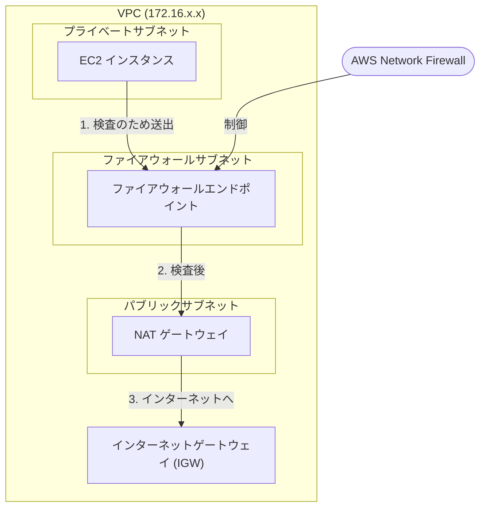

# VPCアーキテクチャ図の追記計画

提供された画像に基づき、AWS Network Firewallを含むVPCアーキテクチャをMermaidと解説テキストで `study-memo/VPC.md` に追加します。

## 画像の言語化（監査用）
- **構成**: VPC（CIDRは画像に基づき 172.16.0.0/16 と推測）内に3つのサブネットを配置。
- **最上部**: インターネットゲートウェイ (IGW)。
- **パブリックサブネット**: NATゲートウェイを配置。
- **ファイアウォールサブネット**: ファイアウォールエンドポイントを配置。Network FirewallはAWSマネージドサービスであり、エンドポイントを通じてVPC内の通信を検査する。
- **プライベートサブネット**: EC2インスタンスを配置。
- **ルーティングフロー**:
  - 送信トラフィック：EC2 (Private) -> ファイアウォールエンドポイント (Firewall Subnet) -> NATゲートウェイ (Public) -> IGW。
  - 戻りトラフィックも同様の経路を通るようルートテーブルを構成する（詳細は追記テキストで解説）。

## Mermaid図の定義

## 変更内容

### [MODIFY] [VPC.md](file:///Users/rhyolite/practice/awssaa_in_the_ghost/study-memo/VPC.md)
以下の内容を末尾に追記します。

#### 1. AWS Network Firewall を含む典型的な構成図 (Mermaid)
- IGW, NAT GW, Firewall Endpoint, EC2 の関係を視覚化。

#### 2. トラフィックフローの解説
- サブネット間のルーティング順序を箇条書きで追加。

## 検証計画
- `VPC.md` を開き、以下の基準を満たしているか確認する。
  - 3つのサブネット（パブリック/ファイアウォール/プライベート）がVPC内に階層化されて描画されていること。
  - トラフィックフローの方向（EC2 -> Endpoint -> NAT GW -> IGW）が矢印で正しく表現されていること。
  - 追加した解説テキストに誤字脱字がないこと。
